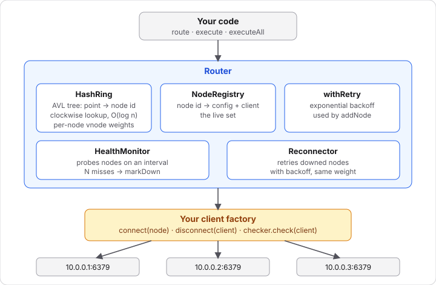
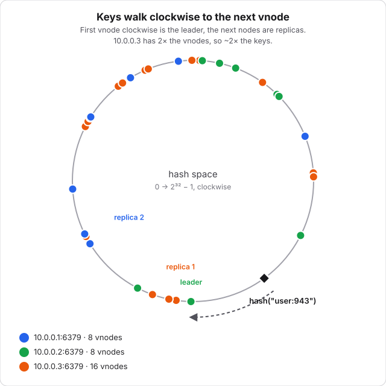
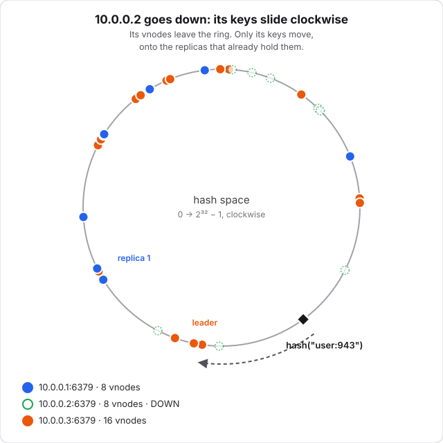

# shardwise

Consistent-hashing router for any cache or database. Give it `host:port` for each node and a function that opens a client. It picks the node that owns each key, replicates to the next nodes, and fails over when one dies.

It doesn't speak any wire protocol. Your driver (ioredis, memjs, pg, a raw socket) still talks to the node; shardwise only picks the node and hands you its client. Zero dependencies.

## Install

```bash
npm install @shardwise/core
```

## Quick start

```ts
import Redis from "ioredis";
import { Router } from "@shardwise/core";

const router = new Router<Redis>({
  connect: async ({ host, port }) => {
    const client = new Redis({
      host,
      port,
      lazyConnect: true,
      retryStrategy: () => null,
    });
    await client.connect();
    return client;
  },
  disconnect: (client) => client.disconnect(),
  replicas: 2,
  health: { checker: { check: async (r) => (await r.ping()) === "PONG" } },
});

await router.addNode({ host: "10.0.0.1", port: 6379 });
await router.addNode({ host: "10.0.0.2", port: 6379 });
await router.addNode({ host: "10.0.0.3", port: 6379, vnodes: 200 }); // bigger box

await router.executeAll("user:1", (r) => r.set("user:1", "ada", "EX", 60)); // leader + replica
const name = await router.execute("user:1", (r) => r.get("user:1")); // fails over if needed

await router.close();
```

## How it works



`Router` is the only class most code touches. It's built from small parts:

| Part            | File                    | Job                                                                 |
| --------------- | ----------------------- | ------------------------------------------------------------------- |
| `HashRing`      | `src/ring.ts`           | Pure key → node mapping, no I/O. Uses the AVL tree in `src/avl.ts`. |
| `NodeRegistry`  | `src/node-registry.ts`  | Node id (`host:port`) → config and live client.                     |
| `HealthMonitor` | `src/health-monitor.ts` | Runs your health check on an interval.                              |
| `Reconnector`   | `src/reconnector.ts`    | Retries a downed node with backoff.                                 |
| `withRetry`     | `src/retry.ts`          | Backoff for the first connect in `addNode`.                         |

You supply the only I/O: `connect`, `disconnect`, and optionally `checker.check`.

### The ring



- Hashes are the first 4 bytes of SHA-1, so the ring is `0 … 2³² − 1`. You can swap the hash.
- Each node sits on the ring at many points (vnodes): `hash("host:port-0")`, `hash("host:port-1")`, …
- A key's **leader** is the first point clockwise from `hash(key)`. The **replicas** are the next distinct nodes after it.
- Points live in an AVL tree, so add, remove and lookup are O(log n).

When a node joins or leaves, only its slice of keys moves. With `hash(key) % N`, nearly every key would.

### Weighted nodes

A node's share of keys is about `its vnodes / total vnodes`. A box with twice the memory gets twice the vnodes:

```ts
await router.addNode({ host: "big", port: 6379, vnodes: 200 });
await router.addNode({ host: "small", port: 6379, vnodes: 100 });
```

The router-level `vnodes` (default 100) applies to nodes that don't set their own. More vnodes means a smoother spread but a bigger tree.

### Failover



A node leaves the ring when a call to it fails, when it misses `failureThreshold` health probes in a row, or when you call `markDown`. Then the router:

1. Removes its points, so its keys resolve to the next node clockwise. That's where their replicas were written.
2. Closes the client with your `disconnect`.
3. Hands the node to the `Reconnector`, which retries with backoff (200 ms doubling to 10 s) and re-adds it with its original weight.

Inside one `execute`, if the leader fails the call moves straight on to the next replica, so the caller usually sees no error.

### Health checks

```ts
interface HealthChecker<C> {
  check(client: C, node: NodeAddress): Promise<boolean | void>;
}
```

Resolve = healthy. Throw, reject, resolve `false`, or exceed `timeoutMs` = failure. Probes never overlap per node, and the timer is `unref`'d. Without a `health` option, nodes are only removed when a call to them fails.

## API

### `new Router<C>(options)`

| Option                      | Default                                                  | Meaning                                                                  |
| --------------------------- | -------------------------------------------------------- | ------------------------------------------------------------------------ |
| `connect(node)`             | required                                                 | Open and return a client. Reject if unreachable.                         |
| `disconnect(client, node)`  | none                                                     | Close a client. Errors are ignored.                                      |
| `vnodes`                    | `100`                                                    | Default ring points per node.                                            |
| `replicas`                  | `3`                                                      | Copies per key, leader included.                                         |
| `retry`                     | `{ maxRetries: 5, baseDelayMs: 200, maxDelayMs: 10000 }` | Backoff for `addNode` and reconnects.                                    |
| `health`                    | off                                                      | `{ checker, intervalMs = 5000, timeoutMs = 2000, failureThreshold = 2 }` |
| `shouldMarkDown(err, node)` | always `true`                                            | Return `false` for errors that aren't the node's fault.                  |
| `hash(value)`               | SHA-1 → uint32                                           | Must return an integer in `0 … 2³² − 1`.                                 |

### Methods

| Method                             | Description                                                                                                                                      |
| ---------------------------------- | ------------------------------------------------------------------------------------------------------------------------------------------------ |
| `addNode({ host, port, vnodes? })` | Connect (with retry) and join the ring. No-op if already present.                                                                                |
| `removeNode({ host, port })`       | Leave the ring, stop reconnecting, close the client.                                                                                             |
| `markDown({ host, port })`         | Leave the ring now and start reconnecting.                                                                                                       |
| `route(key)`                       | `{ node, client }` for the leader. Throws `NoNodesError` if the ring is empty.                                                                   |
| `routeAll(key, count = replicas)`  | Leader-first list of up to `count` distinct routes.                                                                                              |
| `execute(key, fn)`                 | Run `fn(client, node)` on the leader. On error, mark it down (per `shouldMarkDown`) and try the next replica. Throws the last error if all fail. |
| `executeAll(key, fn)`              | Run `fn` on the leader and all replicas in parallel. Resolves with the successes, rejects only if all failed.                                    |
| `close()`                          | Stop probing and reconnecting, close every client.                                                                                               |

`HashRing` is exported too if you only want the mapping: `add`, `remove`, `has`, `ids`, `size`, `getNode`, `getNodes`.

## Limits

- **All processes must agree on the ring.** Same node list, vnode counts and hash, or keys land on different nodes.
- **Replication is client-side and best-effort.** `executeAll` succeeds if one copy does. No quorum, and a replica that missed a write stays stale. Fine for caches, not a substitute for a database's own replication.
- **Failover moves keys, not data.** Reads only find data after a failover if it was written with `replicas ≥ 2` via `executeAll`. A node that comes back may be stale.
- **App errors can eject nodes.** By default any error from `execute`/`executeAll` marks the node down. Use `shouldMarkDown` to ignore things like "key not found".
- **Replicas are capped by live nodes.** 2 live nodes with `replicas: 3` gives 2.
- **Single process.** Router state isn't shared, and there's no logging. Wrap `connect`/`disconnect` if you want visibility.

## Examples

See [`examples/`](examples): `redis.ts` (ioredis with weighted nodes, health checks and replicated writes) and `tcp.ts` (raw TCP socket).

## Contributing

See [CONTRIBUTING.md](CONTRIBUTING.md).

## License

[MIT](LICENSE)
